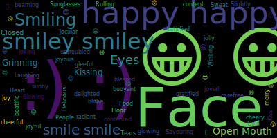

# word_cloud_pyscript

A little word cloud generator  in PyScript

## Screenshot


## Build word_cloud pure version package

```BASH
git clone https://github.com/alitrack/word_cloud
cd word_cloud
python3 setup.py build bdist_wheel --universal # generate wheel in dist folder
```

## Load local packages and local paths

```HTML
  <py-env>
    - pillow
    - ./dist/wordcloud-1.8.2.post3.dev0+g734d7c2-py2.py3-none-any.whl
    - paths:
        - Symbola.ttf
        - happy-emoji.txt
        - emoji.py
  </py-env>
```

